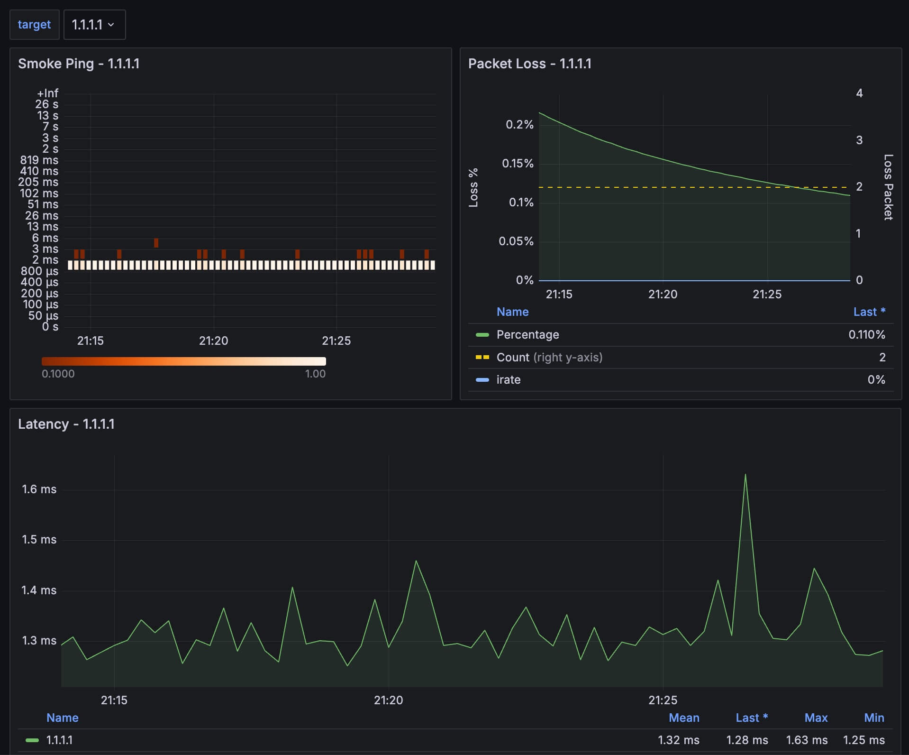

# BETER Network Monitoring (BNM)

This repository contains a set of preconfigured tools to monitor the network.

Services launched:
- Grafana
- Prometheus
- Smokeping-probe

Metrics available on the dashboard:
- Packet loss.
- Ping probe latencies (histogram and average).



## Prerequisites

- [Docker Engine](https://docs.docker.com/engine/install/);
- [Docker Compose Plugin](https://docs.docker.com/compose/install/), not standalone `docker-compose`.

## Running

Steps:

1. Clone the repository.

```shell
$ git clone https://github.com/BETER-CO/beter-network-monitoring.git
$ cd beter-network-monitoring
```

2. Edit `smokeping-prober/config.yaml` and add hosts or IP addresses to monitor.

```shell
targets:
- hosts:
  - 1.1.1.1
  - 8.8.8.8
  - google.com
  interval: 1s # Duration, Default 1s.
  network: ip # One of ip, ip4, ip6. Default: ip (automatic IPv4/IPv6)
  protocol: icmp # One of icmp, udp. Default: icmp (Requires privileged operation)
  size: 56 # Packet data size in bytes. Default 56 (Range: 24 - 65535)
```

3. Run

```shell
$ docker compose up -d
```

Optionally, you can set the following settings via env varibales:
* `BNM_GRAFANA_USER` username of the Grafana admin user (default username is `grafana`).
* `BNM_GRAFANA_PASSWORD` password the the Grafana user (default password is `grafana`).
* `BNM_GRAFANA_PORT` port to expose on host machine to access Grafana (default port is `3000`).

Example,

```shell
$ BNM_GRAFANA_USER=grafana BNM_GRAFANA_PASSWORD=grafana BNM_GRAFANA_PORT=8080 docker compose up -d
```

Alternativelly you may set all environment variables in `.env` file in the root folder of the repo and just launch `docker compose up -d`.

```shell
$ cat .env
BNM_GRAFANA_USER=grafana
BNM_GRAFANA_PASSWORD=grafana
BNM_GRAFANA_PORT=8080

$ docker compose up -d
```

4. Explore metrics in Grafana

Visit [http://localhost:3000/d/i5aRaLaik/smoke-ping?orgId=1](http://localhost:3000/d/i5aRaLaik/smoke-ping?orgId=1) and log in using default or custom credentials. Specify the right port if you redefine it.

## Cleaning

Prometheus data is stored permanently on volume `bnm-prometheus-data`. This volume remains on your host machine after you stop and remove containers by running

```shell
$ docker compose down
```

To remove volume and Prometheus data run

```shell
$ docker compose down -v
```

Both commands must be executed from the root folder of the repository where `docker-compose.yaml` is located.


